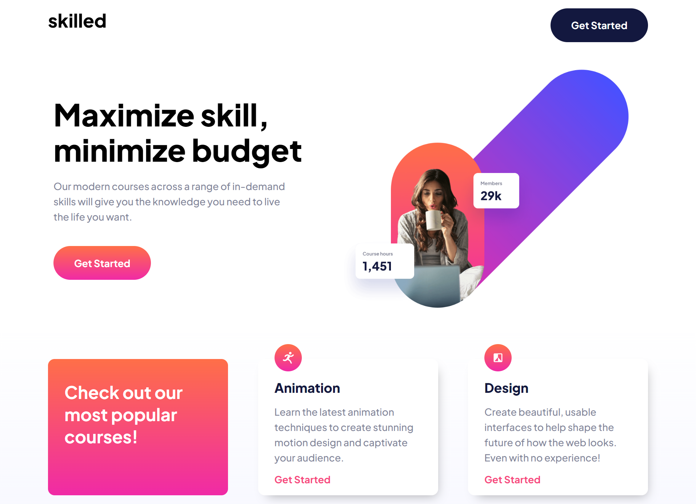

# Netlify Link

- https://react-skilledelearn.netlify.app

# React-Skilled-E-Learning

A Frontend Mentor Skilled e-learning landing page Challenge

# Steps to use Application

## Method 1

<li> Download Entire code
<li> Open code with your favorite code editor [VS code - recommended]
<li> Run npm i or npm install in downloaded files root directory
<li> Wait for depency instally then Run npm start

## Method 2
<li> Download entire code
<li> Simply Host with any of your desired  online cloud service providers 
<li> I recommend [ netlify ]

## Application Not Running
<li> Check if your local machine has Node services
<li> Also cehck for faulty network connection as Node services requiers internet to download the dependencies
<li> still having issues after trying the guide, Feel free to reach out, wo we could resolve them together

  
# Technologies Used  
<li> JSX
<li> CSS [ Styling ]
<li> React Icons [ Icons ]
<li> FrontendMentor [Project Images]
<li> Project Inspiration [Frontend Mentor]
<li> React JS [ Logic / Functionality / Rendering ]
